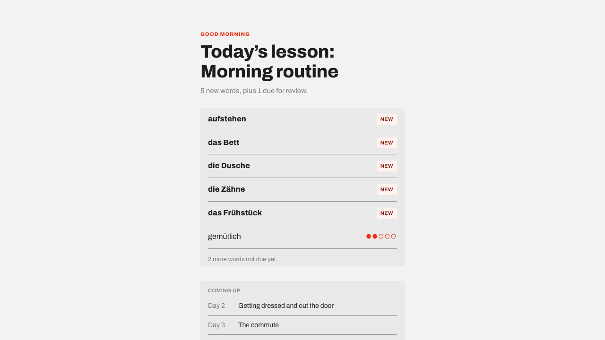

# Morgenwort

A German daily-word learning app: each day surfaces a themed lesson of new
words plus any words due for spaced-repetition review, has you speak each
example sentence aloud, and scores your attempt against what the browser's
speech recognizer actually heard.

**Live:** https://morgenwort.com (also at https://morgenwort-jhovahn1.vercel.app)
· API at https://morgenwort-server.onrender.com. The API is on Render's free
tier, so the first request after idling can take ~30-60s to wake it —
that's Render cold-start behavior, not app latency.



## What's here vs. what's cut

Scoped to the core loop — **speak → done → home**, looping through the
day's lesson and review queue. Cut: permission flow, lock-screen
simulation, quiz mode, extra reviews. Same data model; see
`server/src/content.ts` for where that content would plug in.

- **The curriculum is a real calendar, with the first 2 weeks fully
  written.** `LESSON_CALENDAR` maps day → title → word ids; `VOCAB` is
  derived from it, not authored separately, so a day and its words can't
  drift apart (`content.test.ts` also checks every id resolves). Writing
  all ~90 days of a 3-month curriculum at this quality bar wasn't worth
  the time trade-off yet, and 90 days of thinner, templated content would
  undercut the thing this is actually demonstrating — adding day 15 is
  one more calendar entry plus its content, nothing structural changes.
  Home shows the next 13 days' titles (not their words) as a preview.
- **Scoring is a word-match diff, not phonetic analysis.** Speech-to-text
  is real (Web Speech API); `scoring.ts` diffs the transcript against the
  target sentence, so it can't hear a wrong vowel inside a word it
  otherwise recognized correctly.
- **Feedback tips are Claude-generated, with a curated fallback.** The
  model only phrases the tip from a human-written trouble-spot note
  (`content.ts`) — it never touches scoring. Falls back to that note
  verbatim without `ANTHROPIC_API_KEY` (`tipGenerator.ts`).
- **Progress lives in the browser (`localStorage`), not the server.**
  `server/src/store.ts` holds no state between requests — `getSession` and
  `recordAttempt` are pure functions of whatever progress the client sends
  them, returned back for the client to persist (`web/src/progress.ts`).
  No auth, so there's no real per-user store to build server-side anyway;
  this also means progress survives a Render restart/redeploy, which an
  in-memory store never could. A day advances when its lesson is finished,
  not by real calendar dates — see `store.test.ts` for the scheduling
  edge cases (day boundaries, past-the-calendar fallback, a word that's
  simultaneously today's lesson and technically "due").

## Architecture

Two independent npm projects (no root workspace) — matches the structure
I've used elsewhere for similar full-stack projects:

- **`server/`** — Express 5 + TypeScript (ESM). Owns vocabulary content,
  spaced-repetition scheduling, and attempt scoring. Speech-to-text runs
  client-side in the browser; the one external API call is Claude, used to
  phrase the per-attempt feedback tip, and it falls back to a canned tip
  when `ANTHROPIC_API_KEY` is unset (see `server/.env.example`).
- **`web/`** — React 19 + Vite + TypeScript. Renders the home/speak/done
  flow and captures speech via the Web Speech API, falling back to a manual
  text input in browsers that don't support it (Safari/Firefox).

## Commands

Backend (`server/`):

```bash
npm install
cp .env.example .env   # optionally add ANTHROPIC_API_KEY for live-generated tips
npm run dev      # tsx watch, http://localhost:8787
npm test         # vitest run
npm run build    # tsc -> dist/
npm start        # node dist/index.js
```

Frontend (`web/`):

```bash
npm install
npm run dev       # vite, http://localhost:5173, proxies /api to :8787
npm run lint      # oxlint
npm run build     # tsc -b && vite build
```

Run both `npm run dev` commands concurrently, then open the Vite URL.
**Use Chrome** for real speech recognition — Safari and Firefox don't
implement the Web Speech API, and the app falls back to a text input there.

CI (`.github/workflows/ci.yml`) runs on push/PR to `main`: the server job
builds and runs the vitest suite; the web job lints and builds.

## Deploying

The API and the frontend deploy separately, since they're separate npm
projects — no monorepo tooling, no shared build step.

**API — Render**, from `render.yaml` at the repo root (Blueprint deploy):
root directory `server`, build `npm install && npm run build`, start
`npm start`. Render injects its own `PORT`; `server/src/index.ts` already
reads `process.env.PORT`, so no config needed there. Add
`ANTHROPIC_API_KEY` as a secret in the Render dashboard for live-generated
tips — the blueprint deliberately leaves it unset (`sync: false`) rather
than storing it in the repo.

**Web — Vercel**, with the project root set to `web/` (Vercel auto-detects
the Vite framework preset). Set one environment variable:
`VITE_API_BASE_URL` = the deployed Render URL (e.g.
`https://morgenwort-server.onrender.com`). Without it, `web/src/api.ts`
falls back to relative `/api/...` paths, which only resolve via Vite's
dev-time proxy — fine locally, broken in a static production build, which
is why this is a required var, not an optional one, in prod.

## Testing approach

Coverage is concentrated on the two pure logic modules where correctness
actually matters — `srs.ts` (scheduling: strength transitions, interval
widening, due-date comparison) and `scoring.ts` (word-match diffing:
case/punctuation handling, partial matches, empty input). `tipGenerator.ts`
has one test covering the no-API-key fallback path — the only branch that's
deterministic enough to assert on without mocking the Anthropic SDK, which
felt like more scaffolding than this warrants. `content.test.ts`
checks calendar/vocab integrity (every referenced word id actually
resolves, no duplicates, day numbers consecutive) — worth it specifically
because that data is typed out across two structures at a scale (70+
ids) where a typo is plausible and, without a test, would fail silently:
object-spreading an unresolved id doesn't throw, it just produces a
`VocabItem` with every field `undefined`. `store.ts` (session/progress
computation) has its own suite now that it's stateless, pure functions of
caller-supplied progress rather than a thin wrapper around mutable
in-memory state — the day-boundary and past-the-calendar edge cases are
exactly the kind of thing that's easy to get subtly wrong and hard to
notice by eye. `app.test.ts` hits the actual Express app over HTTP via
`supertest` (routing, JSON parsing, status codes, input validation) —
`index.ts` only calls `app.listen`, so the app itself (exported from
`app.ts`) is testable without a real socket. React components stay
untested; they're thin enough that bugs there would be visually obvious.
